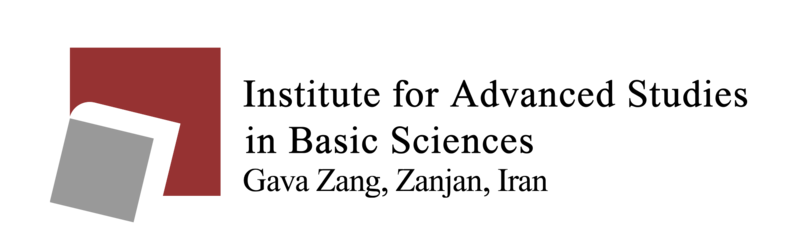

# Machine Learning (Winter 2025)

Welcome to the repository for the **Machine Learning** course offered in Winter 2025 at the **Institute for Advanced Studies in Basic Sciences (IASBS)**.

## Instructor
**Parvin Razzaghi**

## Course Resources

### Slides
This folder contains the main lecture slides along with any accompanying code used during the sessions.

- [Slides](./Slides/)

### Auxiliary Slides
Supplementary material such as auxiliary slides and any accompanying code can be found here.

- [Auxiliary Slides](./Auxiliary%20Slides/)

### Exercises
The exercises for the course, provided as PDFs, are available in this folder.

- [Exercises](./Exercises/)

## Course Videos
The videos of the course are available on [YouTube](https://www.youtube.com/@ParvinRazzaghi).

---

Feel free to use the materials provided in this repository for learning and reference. If you have any questions, issues, or contributions, please open an issue or create a pull request.
